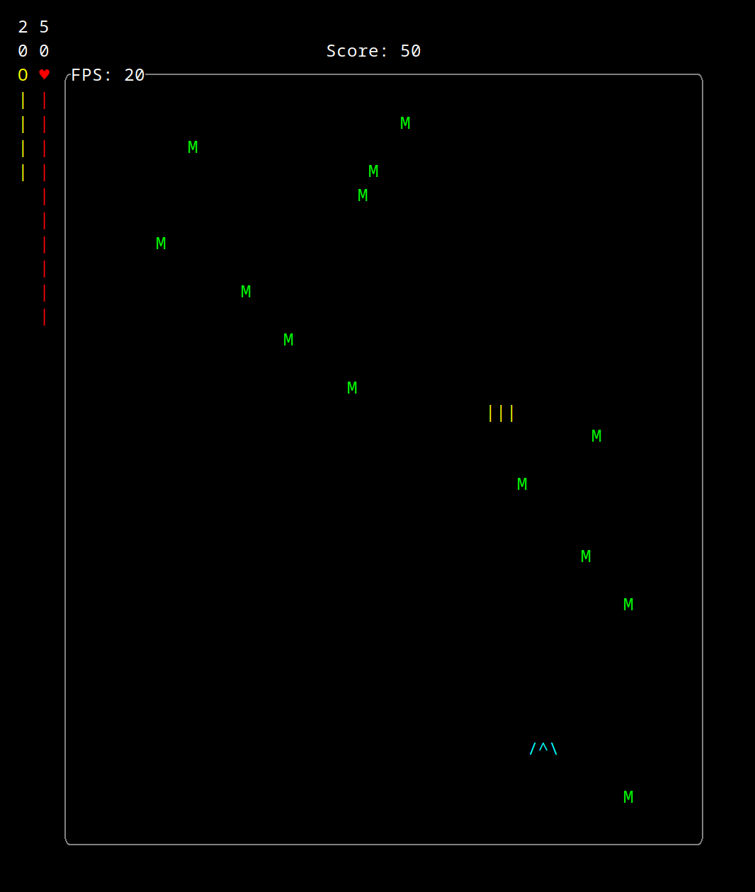
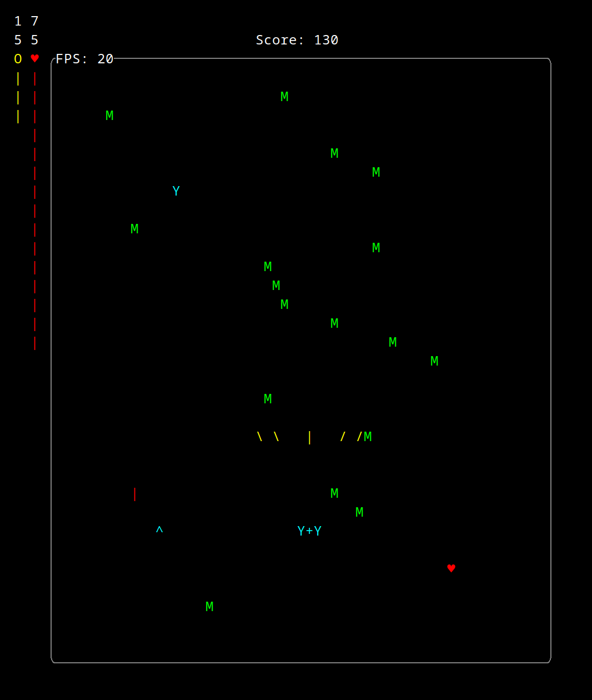
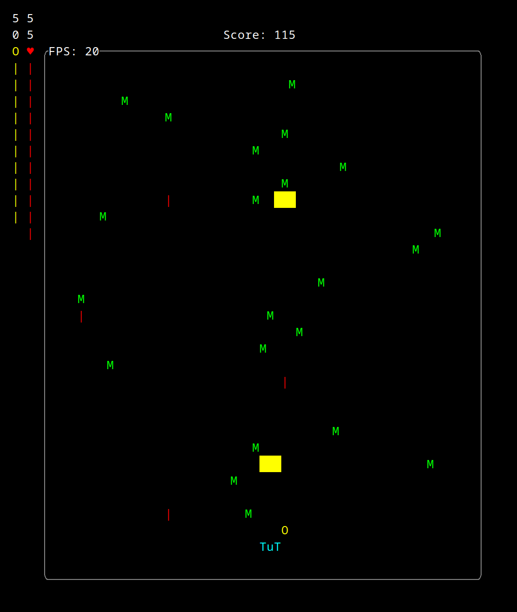

# Th*rust* - a terminal shooter game

Originally created as a project for the "Missing Semester" course at JKU Linz (338.006).

The game is entirely written in the Rust programming language and uses the 
[ruscii](https://github.com/lemunozm/ruscii) library for handling user input,
the basic event loop and colored drawing.

rustcii is a multi-platform crate, so the game should run on Linux, macOS and Windows.  
Note, that for parsing user input on Linux, the X11 Server is (unfortunately) **required**.  


## Game description
The hero is a spaceship starting at the bottom of the screen. It can move around freely in all directions.
Initially every 2 seconds an enemy spawns at the top of the screen. Every 10 seconds the spawn frequency increases 
(until a maximum value).  
As the enemies move downwards, you should attempt to destroy as many as you can.  
Once an enemy escapes (by reaching the ground) this will damage the player's health.  
Every destroyed enemy drops a random goodie that can be picked up by touching it.  
The game keeps track of how many enemies were destroyed by the player and accumulates a total score.  
The game is over, once the player's health reaches 0.

## Controls

Use <kbd>W</kbd> <kbd>S</kbd> <kbd>A</kbd> <kbd>D</kbd> to move the spaceship.  
Pressing <kbd>Space</kbd> toggles the ship's auto-shoot.  
Both <kbd>Esc</kbd> and <kbd>Q</kbd> will quit the game.

## Implementation details

The game is capped at 20 frames per second.  
The field size is 60 characters in x-direction and 32 in y-direction.  
Due to characters in a terminal generally being twice as high as wide, 
the player moves two times as fast in the horizontal direction than the vertical one.
This can lead to problems shooting enemies with width 1 and can cause involuntary skipping elements.  
As following the ship is 3 characters long and fires 3 shots at once each time. This makes it easier to catch goodies
and hit enemies.  

### HUD
On the left of the game field the health and shield bar are drawn.  
At the top of the field the current score is displayed.  
A border is drawn around the game field, to make it clear where enemies appear/disappear and shots disintegrate.  
Embedded in the border the current FPS counter is displayed.

### Goodies

Destroying an enemy leads to the drop of a goodie on its current position.  
A goodie is one out of three types:
 - `♥`: RepairKit --  heals the ship by 5 health (max 100)
 - `O`: ShieldBoost -- increases the current shield charge by 10 points (max 100)
 - `^` or `Y` or `T`: ShipUpgrade -- causes a ship and main weapon change

### Ship types

By picking up a ship upgrade, the type of weapon changes.
There are by now 3 different ones:
 - `^` ->  `/^\ ` -> shoots 3 straight usual `|` shots; These disappear once they hit something
 - `Y` -> `Y+Y` -> shoots 4 diagonal shots and one usual straight shot
 - `T` -> `TuT` -> shoots 3 powerful `█` shots which destroy and go through enemies

### Damage

Different types of events hurt the ship and its shield in different magnitude.

 - hit by enemy shot -- 5 damage to shield or health
 - collision with enemy -- 50 damage to shield or health
 - enemy escapes (ground) - 15 direct damage to health, **bypasses** the shield

Even if the shield is on minimum (5), it will block the full collision damage.
When having 5 shield, you can hit an enemy to quickly destroying it instead of receiving 15 direct damage.

## Dependencies

 - [ruscii](https://github.com/lemunozm/ruscii) (and sub-dependencies) for input handling, the event loop, and rendering the game
 - [rand](https://docs.rs/rand/latest/rand/) to choose random goodies and new enemies' horizontal spawn positions

## Usage

To compile the game, the rust package manager and compiler `cargo` is required.  
To run the game, you can clone this repository and execute:

```shell
cargo run
```

Debugging is complicated, because `stdout` is used to display the interface.  
It is, however, possible to log messages to `stderr` using `eprintln!` and run 
the app while redirecting the error stream to a file ([instructions from](https://github.com/lemunozm/ruscii#debugging)):

```shell
export RUST_BACKTRACE=1
cargo run 2> my_stderr
```

For simply trying out the app, Windows and Linux binaries are pre-compiled and provided in the releases section.

## Test environment

All development and testing was done under Arch Linux (Kernel 6.1.4-arch1-1) with:
- cargo 1.65.0
- rustup 1.25.1
- rustc 1.65.0
- edition = "2021"
- ruscii = "0.3.2"
- rand = "0.8.5"

For minimum input lag when rendering many elements and best performance the
[alacritty](https://github.com/alacritty/alacritty) terminal emulator was used for running the application.

## Effort and research

A lot of effort went into researching and trying out different terminal/console game engines.
Due to personal recommendations, I wanted to avoid the complexity and learning curve of the 
[ncurses](https://github.com/mirror/ncurses) library (this is probably the best library for creating terminal based UIs out there).

One of the first Google search results when searching for "terminal game engine" are 
 - [Termgine](https://github.com/Morasiu/Termgine) and
 - [Termloop](https://github.com/JoelOtter/termloop) (based on [Termbox](https://github.com/nsf/termbox-go))

The first was poorly documented and would require the C# programming language (in which im rusty).  

An alternative C# framework would have been:
 - [SadConsole](https://github.com/Thraka/SadConsole)

This seemed to be more optimized for general terminal UI building, not focused on games.

I've decided to use Termloop, written in Go and started  getting familiar with the Golang language a bit.
When I was finally starting implementation, I've realized that this engine does not support key-down/key-up events.
Thus moving in two directons at once (diagonally) would be practically impossible. 
Also, it was a bit laggy.  

I've then investigated some other libraries that would support these traits, like:
 - [doryen-rs](https://github.com/jice-nospam/doryen-rs).

It seemed promising, but complex. Especially the WASM support catched my eye.  

There seemed to be many frameworks in Rust, so I've compared some of them.  

Finally, I've decided to use [ruscii](https://github.com/lemunozm/ruscii) as a base framework.  
It had key-down/key-up events, while being simple enough to understand.  
Furthermore there was a demo application that corresponded to a simple version of what I planned to create.

So I've (re-)learned myself the Rust programming language.  

After all this research, I spent about another 30 hours of development time in my IDE to create this game.  


## Demos and screenshots

The following 3 screenshots shows how a gameplay moment might look like with the three different ship types.

- default shot type (3 straight frontal ones), 50 health, 20 shield, 50 score



- spread shot (4 diagonal ones, 1 straight), 75 health, 15 shield, 130 score, several goodies 



- strong shot (3 strong, straight, surviving shots), 55 health, 50 shield, 115 score, shield goodie



- game over screen, final score 215


## Future work and ideas

Many more hours can be put into the game to better optimize it and make it more interesting.

Ideas for the game:
 - more goodies: like rapid shot 
 - different ship sizes and coloring art
 - stronger (and bigger) enemies, that require more than one hit (and change color according to health)
 - bosses
 - pre-defined levels and progress
 - saving the local high-score to a file and display/update the current best
 - enter name
 - loading screen with tutorial/instructions
 - super weapon (goodie?) like bomb that clears (parts of the) screen damaging all enemies
 - ...


Further ideas for the projects:
 - use WASM to compile for browser support
 - deploy to a Kubernetes cloud service and provide public IP to play
 - try to port the game to different frameworks (like doryen-rs) and experiment with performance and features
 - compile a macOS version
 - make [asciinema](https://asciinema.org/) live demo 
 - ...
